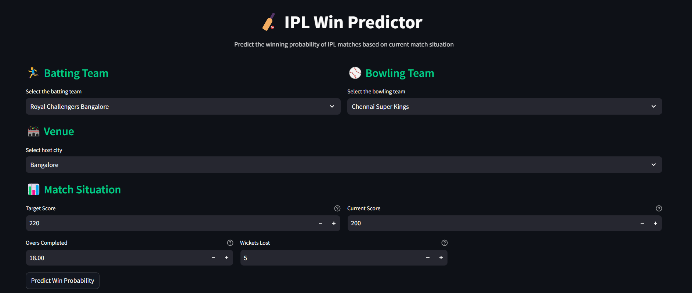
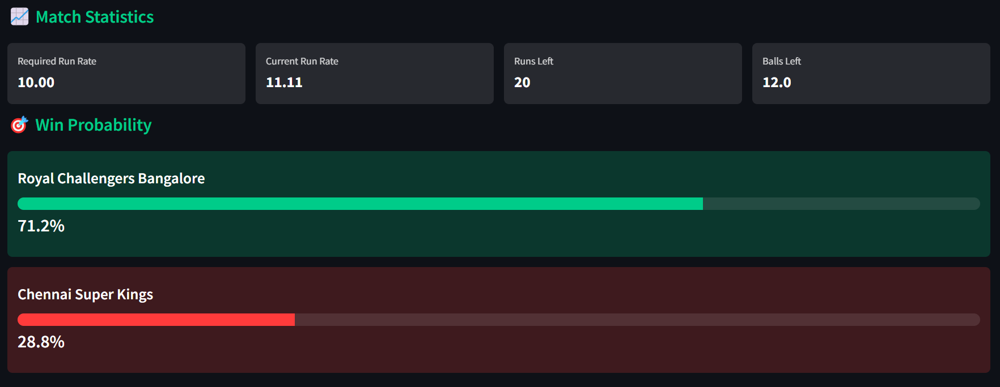

# 🏏 IPL Win Predictor

### Predict IPL match outcomes with machine learning magic! ✨

A machine learning-powered web application that predicts the probability of teams winning IPL matches based on match conditions.

## ⚡ Quick Access

> **Try it now:** [IPL Win Predictor App](https://iplwinpredictor-cgtgv4wkldvkijjr4gjpw5.streamlit.app/)

No installation needed! Simply visit our live app to start predicting IPL match outcomes instantly.

## 🌟 Features

<table>
<tr>
<td width="50%">

### 🎯 Smart Predictions
- Real-time win probability calculations
- Dynamic match statistics updates
- ML-powered outcome analysis
- Instant visual feedback

</td>
<td width="50%">

### 📊 Match Analytics
- Required & Current Run Rates
- Balls & Runs remaining analysis
- Wickets in hand impact
- Comprehensive statistics dashboard

</td>
</tr>
<tr>
<td width="50%">

### 🎨 Beautiful Interface
- Clean, modern design
- Intuitive controls
- Responsive layout
- Cross-device compatibility

</td>
<td width="50%">

### 🔥 Pro Features
- Support for all IPL teams
- Multiple venue options
- Real-time updates
- Historical data analysis

</td>
</tr>
</table>

## 💻 Usage Guide

### Step 1: Access the App
Visit [IPL Win Predictor](https://iplwinpredictor-cgtgv4wkldvkijjr4gjpw5.streamlit.app/)

### Step 2: Enter Match Details
1. Select batting team
2. Choose bowling team
3. Pick match venue
4. Enter target score

### Step 3: Input Current Situation
1. Current score
2. Overs completed
3. Wickets lost

### Step 4: Get Predictions
Click "Predict Win Probability" to see:
- Win probabilities for both teams
- Required run rate
- Current run rate
- Balls and runs remaining

## 🚀 Local Development Setup

```bash
# Clone the repository
git clone https://github.com/Tusharr06/IPL_WIN_PREDICTOR.git

# Navigate to directory
cd IPL_WIN_PREDICTOR

# Install dependencies
pip install -r requirements.txt

# Run the application
streamlit run app.py
```

## 🛠️ Technology Stack

<div align="center">

| Technology | Purpose |
|------------|---------|
|  | Core Language |
|  | Web Framework |
|  | ML Model |
|  | Data Processing |

</div>

## 📦 Requirements

```txt
streamlit>=1.0.0    # Web framework
pandas>=1.3.0       # Data manipulation
scikit-learn>=0.24  # Machine learning
pickle-mixin>=1.0.2 # Model serialization
```

## Screenshots




## 🤝 Contributing

We ❤️ contributions! Here's how you can help:

<table>
<tr>
<td>

### 🐛 Bug Reports
1. Use the issue tracker
2. Describe the bug
3. Share reproduction steps

</td>
<td>

### 💡 Feature Requests
1. Open a new issue
2. Describe your idea
3. Discuss with community

</td>
<td>

### 🔀 Pull Requests
1. Fork the repo
2. Create your branch
3. Submit changes

</td>
</tr>
</table>

## 🔍 How It Works

The application uses a machine learning model trained on historical IPL data to predict match outcomes. It considers various factors:

- Team performance history
- Venue statistics
- Current match situation
- Required run rate
- Wickets in hand
- Historical chase records

## 🌟 Key Advantages

1. **Accuracy**: Trained on comprehensive IPL data
2. **Real-time**: Instant predictions
3. **User-friendly**: Simple interface
4. **Comprehensive**: Detailed statistics
5. **Accessible**: No installation needed
6. **Free**: Open source and free to use


---

<div align="center">
